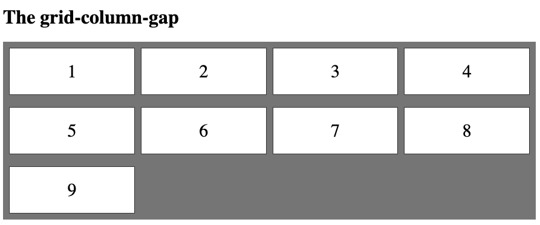

<!-- ---
title: CSS Grid Layout
date: 2021-07-17
tags:
  - CSS Grid
categories:
  - CSS
---

During our develpoment, most of the time, we just use libraries for the grid layout like bootstrap `row` & `col`. In addition, for the responsive design, we can easily try `sm={12}`, `md= {6}` and `lg={3}` by these libraries.

Today let's get rid of these libraries and discover the native css grid layout.

## Introduction

The CSS Grid Layout Module offers a grid-based layout system, with rows and columns, making it easier to design web pages without having to use floats and positioning.

```html
<h1>The grid-column-gap</h1>
<div class="grid-container">
  <div class="grid-item">1</div>
  <div class="grid-item">2</div>
  <div class="grid-item">3</div>
  <div class="grid-item">4</div>
  <div class="grid-item">5</div>
  <div class="grid-item">6</div>
  <div class="grid-item">7</div>
  <div class="grid-item">8</div>
  <div class="grid-item">9</div>
</div>
```

```css
.grid-container {
  display: grid;
  grid-column-gap: 10px;
  grid-row-gap: 20px;
  grid-template-columns: auto auto auto auto;
  background-color: grey;
  padding: 10px;
}

.grid-item {
  background-color: white;
  border: 1px solid rgba(0, 0, 0, 0.8);
  padding: 20px;
  font-size: 30px;
  text-align: center;
}
```

Result:



## Grid Container

To make an HTML element behave as a grid container, you have to set the `display` property to `grid` or `inline-grid`.

Grid containers consist of grid items, placed inside columns and rows.

### The grid-template-columns Property

The grid-template-columns property defines the number of columns in your grid layout, and it can define the width of each column.

The value is a space-separated-list, where each value defines the width of the respective column.

If you want your grid layout to contain 4 columns, specify the width of the 4 columns, or "auto" if all columns should have the same width.

Example: Make a grid with 4 columns

```css
.grid-container {
  display: grid;
  grid-template-columns: auto auto auto auto;
}
```

:::tip
Note: If you have more than 4 items in a 4 columns grid, the grid will automatically add a new row to put the items in.
:::

The `grid-template-columns` property can also be used to specify the size (width) of the columns.

Example: Set a size for the 4 columns

```css
.grid-container {
  display: grid;
  grid-template-columns: 80px 200px auto 40px;
}
```

### The grid-template-rows Property

The grid-template-rows property defines the height of each row.

Example:

```css
.grid-container {
  display: grid;
  grid-template-rows: 100px 200px;
}
```


### The justify-content Property

The `justify-content` property is used to align the whole grid inside the container.

:::tip
Note: The grid's total width has to be less than the container's width for the justify-content property to have any effect.
:::

```css
.grid-container {
  display: grid;
  justify-content: space-evenly;
}
```

### The align-content Property

The `align-content` property is used to vertically align the whole grid inside the container.

:::tip
Note: The grid's total height has to be less than the container's height for the align-content property to have any effect.
:::

```css
.grid-container {
  display: grid;
  height: 400px;
  align-content: center;
}
```

## Grid Item

### Items - Child Elements

A grid container contains grid items.

By default, a container has one grid item for each column, in each row, but you can style the grid items so that they will span multiple columns and/or rows.

### The grid-column Property

The `grid-column` property defines on which column(s) to place an item.

You define where the item will start, and where the item will end.

:::tip
Note: The `grid-column` property is a shorthand property for the `grid-column-start` and the `grid-column-end` properties.
:::

To place an item, you can refer to line numbers, or use the keyword "span" to define how many columns the item will span.

Example:

```html
<div class="grid-container">
  <div class="item1">1</div>
  <div class="item2">2</div>
  <div class="item3">3</div>
  <div class="item4">4</div>
  <div class="item5">5</div>
  <div class="item6">6</div>
  <div class="item7">7</div>
  <div class="item8">8</div>
  <div class="item9">9</div>
  <div class="item10">10</div>
  <div class="item11">11</div>
  <div class="item12">12</div>
  <div class="item13">13</div>
  <div class="item14">14</div>
  <div class="item15">15</div>
  <div class="item16">16</div>
</div>
```

```css
.grid-container {
  display: grid;
  grid-template-columns: auto auto auto auto auto auto;
  grid-gap: 10px;
  background-color: grey;
  padding: 10px;
}

.grid-container > div {
  background-color: white;
  text-align: center;
  padding: 20px 0;
  font-size: 30px;
}

.item1 {
  grid-column: 1 / span 3;
}
```


### The grid-row Property

The grid-row property defines on which row to place an item.

You define where the item will start, and where the item will end.

:::tip
Note: The `grid-row` property is a shorthand property for the `grid-row-start` and the `grid-row-end` properties.
:::

To place an item, you can refer to line numbers, or use the keyword "span" to define how many rows the item will span.

Example:

```html
<div class="grid-container">
  <div class="item1">1</div>
  <div class="item2">2</div>
  <div class="item3">3</div>
  <div class="item4">4</div>
  <div class="item5">5</div>
  <div class="item6">6</div>
  <div class="item7">7</div>
  <div class="item8">8</div>
  <div class="item9">9</div>
  <div class="item10">10</div>
  <div class="item11">11</div>
  <div class="item12">12</div>
  <div class="item13">13</div>
  <div class="item14">14</div>
  <div class="item15">15</div>
  <div class="item16">16</div>
</div>
```

```css
.grid-container {
  display: grid;
  grid-template-columns: auto auto auto auto auto auto;
  grid-gap: 10px;
  background-color: grey;
  padding: 10px;
}

.grid-container > div {
  background-color: white;
  text-align: center;
  padding: 20px 0;
  font-size: 30px;
}

.item1 {
  grid-row: 1 / 4;
}
```


### The grid-area Property

The `grid-area` property can be used as a shorthand property for the `grid-row-start`, `grid-column-start`, `grid-row-end` and the `grid-column-end` properties.

Example:

```html
<div class="grid-container">
  <div class="item1">1</div>
  <div class="item2">2</div>
  <div class="item3">3</div>
  <div class="item4">4</div>
  <div class="item5">5</div>
  <div class="item6">6</div>
  <div class="item7">7</div>
  <div class="item8">8</div>
  <div class="item9">9</div>
  <div class="item10">10</div>
  <div class="item11">11</div>
  <div class="item12">12</div>
  <div class="item13">13</div>
  <div class="item14">14</div>
  <div class="item15">15</div>
  <div class="item16">16</div>
</div>
```

```css
.grid-container {
  display: grid;
  grid-template-columns: auto auto auto auto auto auto;
  grid-gap: 10px;
  background-color: grey;
  padding: 10px;
}

.grid-container > div {
  background-color: white;
  text-align: center;
  padding: 20px 0;
  font-size: 30px;
}

.item8 {
  grid-area: 1 / 2 / 5 / 6;
}
```


### Naming Grid Items

The `grid-area` property can also be used to assign names to grid items.

Named grid items can be referred to by the grid-template-areas property of the grid container.

Each row is defined by apostrophes (' ')

The columns in each row is defined inside the apostrophes, separated by a space.

:::tip
Note: A period sign represents a grid item with no name.
:::

Example:

```html
<div class="grid-container">
  <div class="item1">Header</div>
  <div class="item2">Menu</div>
  <div class="item3">Main</div>
  <div class="item4">Right</div>
  <div class="item5">Footer</div>
</div>
```

```css
.item1 {
  grid-area: header;
}
.item2 {
  grid-area: menu;
}
.item3 {
  grid-area: main;
}
.item4 {
  grid-area: right;
}
.item5 {
  grid-area: footer;
}

.grid-container {
  display: grid;
  grid-template-areas:
    "header header header header header header"
    "menu main main main right right"
    "menu footer footer footer footer footer";
  grid-gap: 10px;
  background-color: grey;
  padding: 10px;
}

.grid-container > div {
  background-color: white;
  text-align: center;
  padding: 20px 0;
  font-size: 30px;
}
```


### The Order of the Items

The Grid Layout allows us to position the items anywhere we like.

:::tip
The first item in the HTML code does not have to appear as the first item in the grid.
:::

You can re-arrange the order for certain screen sizes, by using media queries:

Example:

```html
<div class="grid-container">
  <div class="item1">1</div>
  <div class="item2">2</div>
  <div class="item3">3</div>
  <div class="item4">4</div>
  <div class="item5">5</div>
  <div class="item6">6</div>
</div>
```

```css
.grid-container {
  display: grid;
  grid-template-columns: auto auto auto;
  grid-gap: 10px;
  background-color: #2196f3;
  padding: 10px;
}

.grid-container > div {
  background-color: rgba(255, 255, 255, 0.8);
  text-align: center;
  padding: 20px 0;
  font-size: 30px;
}

@media only screen and (max-width: 500px) {
  .item1 {
    grid-area: 1 / span 3 / 2 / 4;
  }
  .item2 {
    grid-area: 3 / 3 / 4 / 4;
  }
  .item3 {
    grid-area: 2 / 1 / 3 / 2;
  }
  .item4 {
    grid-area: 2 / 2 / span 2 / 3;
  }
  .item5 {
    grid-area: 3 / 1 / 4 / 2;
  }
  .item6 {
    grid-area: 2 / 3 / 3 / 4;
  }
}
```

Web:


Mobile (<500px):

 -->
